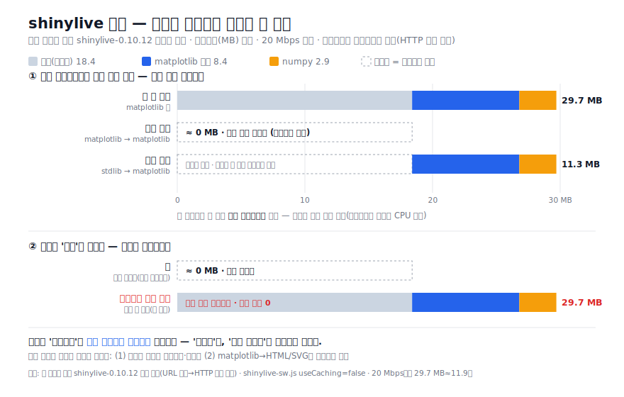

# 빛스탯 HS · shinylive 에셋 캐시 공유 기술검토

**질문:** pages에 여러 qmd(모듈)가 있는데, **한 페이지를 처음 다운로드한 뒤**에는
나머지 qmd 페이지들도 (캐시 공유로) 모두 빠르게 열리는가? 링크를 **공유**하면 어떤가?
**작성일:** 2026-07-07 · **근거:** `docs/site_libs/.../shinylive-0.10.12` 실측



---

## 0. 짧은 답 (TL;DR)

**부분적으로 맞다 — 단, "누가·무엇을"에 따라 갈린다.**

| 상황 | 빨라지나? | 이유 |
|---|---|---|
| **같은 브라우저**로 다음 모듈 페이지 열기 | **대체로 예** | 공통 런타임 18.4 MB 등 **이미 받은 same-URL 에셋은 HTTP 캐시**에서 재사용 → 다운로드 생략 |
| 앞 페이지가 **안 받은 패키지**를 뒷 페이지가 필요 | 그 부분은 **아니오** | 예: stdlib 페이지 먼저 → matplotlib 페이지 가면 matplotlib 스택(약 11 MB) **새로 다운로드** |
| 어느 페이지든 **재초기화** | **아니오(항상 비용)** | 페이지 이동 = 새 문서 로드 → Pyodide가 **매번 다시 부팅**(다운로드가 아니라 초기화 시간) |
| **다른 사람에게 링크 공유** | **아니오** | 캐시는 **브라우저별**. 받은 사람은 빈 캐시 → 첫 방문 전체 다운로드 |

즉 **"내 브라우저 안에서 이동"은 빨라지지만, "공유받은 남"에게는 아무 이득이 없다.**
그리고 캐시가 없애 주는 건 *다운로드*이지 *초기화*가 아니다.

---

## 1. 작동 원리 — 왜 같은 브라우저에선 빨라지나

### 1.1 모든 모듈이 하나의 에셋 세트를 공유 (실측 확인)

렌더된 모든 페이지가 **동일한 버전 경로**를 참조한다.

```
../../../site_libs/quarto-contrib/shinylive-0.10.12/...   # freq_table
../../../site_libs/quarto-contrib/shinylive-0.10.12/...   # normal, combi_repeat, …
```

상대경로 깊이는 달라도 **최종 절대 URL은 동일**하다. 브라우저 HTTP 캐시는 URL 단위이므로,
한 페이지가 `pyodide.asm.wasm`(9.6 MB)을 받아 캐시하면 **다른 페이지는 같은 URL을
캐시에서** 가져온다 → 재다운로드 없음.

공유되는 대용량 에셋(어떤 앱이든 공통):

| 파일 | 크기 |
|---|---:|
| pyodide.asm.wasm | 9.6 MB |
| shiny 휠 | 3.8 MB |
| python_stdlib.zip | 2.3 MB |
| pyodide.asm.js | 1.2 MB |
| shinylive.js | 1.5 MB |
| **공통 소계** | **≈ 18.4 MB** |

이 18.4 MB는 **첫 앱 로드 후 캐시**되어, 이후 어떤 모듈로 이동해도 다시 받지 않는다.
이것이 "처음 받으면 나머지가 빨라진다"는 체감의 실체다.

### 1.2 단, 패키지 휠은 "쓰는 페이지"에서만 캐시된다

Pyodide는 **각 앱이 실제로 import한 패키지만** 그때그때 받는다(총 37개 휠 중 필요분).
그래서 캐시에 무엇이 들어있는지는 **어떤 페이지를 먼저 열었는지**에 달렸다.

| 먼저 연 페이지 | 다음 페이지 | 새로 받는 것 |
|---|---|---|
| matplotlib 앱 | matplotlib 앱 | 없음(모두 캐시) — **다운로드 0, 재초기화만** |
| matplotlib 앱 | stdlib 앱 | 없음 |
| **stdlib 앱** | **matplotlib 앱** | matplotlib+numpy+fonttools+pillow **≈ 11 MB 새로** |
| stdlib 앱 | stdlib 앱 | 없음 |

> 이 사이트는 25개 중 20개가 matplotlib을 쓰므로, 사용자가 무거운 앱을 한 번 열면
> 이후 대부분의 모듈이 다운로드 없이 열린다. 반대로 가벼운 앱(중복조합 등)만 돌다가
> 무거운 앱으로 가면 그 순간 11 MB를 새로 받는다.

---

## 2. 캐시가 없애 주지 못하는 것 — 재초기화 비용

빛스탯 HS는 **일반 다중 페이지 사이트**다(모듈 간 이동 = `<a href>`로 새 HTML 로드).
따라서 페이지를 옮길 때마다:

1. 새 문서 로드 → JS 컨텍스트 초기화
2. **Pyodide 워커를 새로 부팅** (stdlib 압축 해제, `shiny`·`numpy`·`matplotlib` import)
3. matplotlib 앱이면 **폰트 매니저 캐시 재구축**(첫 플롯 지연)

이 초기화는 **다운로드가 아니라 CPU 시간**이라 HTTP 캐시로 사라지지 않는다.
따라서 캐시가 데워진 2회차 이후에도 각 페이지는 "즉시"가 아니라 **수 초의 부팅**을 겪는다.
(첫 방문의 "수십 초"가 "수 초"로 줄 뿐, 0이 되지는 않는다.)

---

## 3. "공유"의 두 해석 — 오해 주의

- **(A) 내가 다음 페이지로 이동/공유** = 같은 브라우저 → §1대로 다운로드 이득 있음.
- **(B) 링크를 다른 사람에게 공유** = **다른 브라우저·기기** → **캐시 공유 없음**.
  받은 사람은 처음 여는 페이지에서 런타임 18.4 MB(+ 그 앱의 패키지)를 **전부 새로** 받는다.

HTTP 캐시는 브라우저 로컬 저장소다. 서버가 여러 사용자에게 캐시를 공유해 주지 않는다.
"한 명이 받아 두면 팀 전체가 빠르다"는 성립하지 않는다.

---

## 4. 캐시는 얼마나 오래 유지되나 (지속성)

- **서비스워커 지속 캐시는 꺼져 있다.** 이 빌드의 `shinylive-sw.js`는 `useCaching = false`로,
  Cache API에 에셋을 영구 저장하지 **않는다**. 즉 지속성은 순수 **브라우저 HTTP 캐시**에 의존.
- **HTTP 캐시 수명은 호스트 헤더에 달렸다.** GitHub Pages는 통상 `Cache-Control: max-age=600`
  (약 10분) + `ETag`를 준다. TTL이 지나면 **재검증**(조건부 요청)이 일어나지만, 파일이
  그대로면 `304 Not Modified`로 **본문 재다운로드는 없다**(경로가 버전 고정이라 유리).
- 다만 브라우저가 용량 압박으로 캐시를 축출하거나, 사용자가 캐시를 비우면 다시 받는다.
- **정확한 값은 실측**: DevTools Network 탭에서 각 에셋의 `Cache-Control`/`ETag`/`(disk cache)`
  표시로 확인 권장.

---

## 5. 부수 발견 — shinylive SW가 COI 헤더를 주입한다

`shinylive-sw.js`는 응답에 **`Cross-Origin-Embedder-Policy: require-corp`** 와
`Cross-Origin-Resource-Policy`를 붙인다(`addCoiHeaders`). 즉 헤더 설정이 불가능한
GitHub Pages에서도 shinylive가 **서비스워커로 교차 출처 격리(COI)를 스스로 활성화**한다.
→ [성능검토 문서](shinylive-performance-review.md)의 권고 ④(COOP/COEP)는 **이미 부분 적용
상태**이므로, 별도 도입 우선순위는 낮다(실측으로 SharedArrayBuffer 활성 여부만 확인).

---

## 6. 결론 & "나머지도 정말 빠르게" 만들려면

**결론.** "처음 받으면 나머지가 빨라진다"는 **같은 브라우저 안에서만, 그리고 다운로드
부분에 한해** 맞다. (a) 다른 사람에게 공유하면 이득 없음, (b) 페이지마다 재초기화 비용은
남음, (c) 앞서 안 받은 패키지는 뒷 페이지에서 새로 받음.

**실제로 "모두 빠르게"에 가깝게 하려면** — 캐시에 기대는 것을 넘어 능동적으로:

1. **랜딩(홈)에서 런타임 프리로드/워밍업** — 사용자가 첫 모듈을 열기 전에 홈에서
   `pyodide.asm.wasm`·`shiny 휠` 등 공통 18.4 MB를 미리 받아 캐시 → 이후 어떤 모듈로
   들어가도 다운로드가 이미 끝나 있음. (헤비 패키지도 홈에서 선로드 가능)
2. **패키지 페이로드 자체 축소** — matplotlib→HTML/SVG 전환으로 §1.2의 "11 MB 새로 받기"
   상황을 없앰(가벼운↔무거운 페이지 간 격차 해소). [성능검토 문서](shinylive-performance-review.md) 권고 ①·② 참조.
3. **(고급) 재초기화 최소화** — 클라이언트 사이드 내비게이션(SPA화)이나 한 페이지 다중 탭으로
   Pyodide 재부팅을 줄임. 구조 변경 폭이 커 ROI는 낮음 → 장기 과제.

> 요약: **캐시는 "다운로드"를 공유하지, "초기화"나 "다른 사용자"를 공유하지 않는다.**
> 체감 속도를 확실히 올리는 지렛대는 (1) 프리로드와 (2) 페이로드 축소다.
