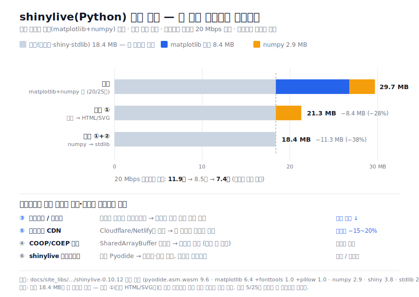

# 빛스탯 HS · shinylive(Python) 성능 개선 기술검토

**대상:** 빛스탯 HS (Quarto + shinylive-python, Pyodide 런타임)
**작성 목적:** 현재 사이트의 shinylive 앱 로딩·실행 속도를 더 높이기 위해 추가로 취할
작업을 실측 기반으로 검토하고 우선순위를 제시한다.
**작성일:** 2026-07-07

> ⚠️ **이 문서와 그림은 "계획·분석"이다. 아래 권고는 아직 코드에 적용되지 않았다.**
> 그림의 21.3 MB·18.4 MB는 권고 ①·②를 **구현했을 때의 예상치**이며, 현재 사이트에서
> 실제로 달라진 것은 없다(기존 5/25개 모듈이 이미 HTML/stdlib인 것은 이전 작업의 부수 결과일 뿐,
> 이번 성능 목적의 전환이 아니다). 실제 최적화는 §4 로드맵을 코드로 실행해야 이뤄진다.

---

## 0. 요약 (TL;DR)

사용자가 느끼는 shinylive 속도는 사실상 **최초 콜드 스타트**(런타임·패키지 다운로드 +
초기화)가 지배한다. 언어(Python vs R)의 실행 속도 문제가 아니라 **얼마나 많은 바이트를
받아 초기화하느냐**의 문제다.

측정 결과, **matplotlib 스택(약 8.4MB)** 이 단일 최대 부담이며 **25개 앱 중 20개**가
이를 로드한다. 따라서 우선순위는 명확하다.

| 순위 | 작업 | 예상 효과 | 난이도 |
|---|---|---|---|
| 1 | **단순 차트의 matplotlib → HTML/SVG 전환** | 해당 앱 페이로드 약 −35~40% | 중 |
| 2 | **numpy 사소 사용 제거**(stdlib 대체) | 해당 앱 약 −2.9MB | 하 |
| 3 | **랜딩 페이지에서 런타임 프리로드/워밍업** | 체감 대기 은닉 | 하~중 |
| 4 | **Cross-Origin Isolation(COOP/COEP)** | 초기화 소폭 개선 | 중 |
| 5 | **브로틀리 압축 CDN 전환**(Cloudflare/Netlify) | 전송량 −15~20% | 중 |
| 6 | **shinylive 버전 업그레이드**(최신 Pyodide) | 초기화·용량 소폭 개선 | 하 |

---

## 1. 현재 구조 진단 (실측)

### 1.1 에셋 페이로드 분해 (`docs/site_libs/.../shinylive-0.10.12`, 압축 전 원본 크기)

| 파일 | 크기 | 로드 시점 |
|---|---:|---|
| `pyodide.asm.wasm` | 9.6 MB | 모든 앱 (런타임 코어) |
| `matplotlib-3.8.4-*.whl` | 6.4 MB | matplotlib 사용 앱 |
| `shiny-1.6.3-*.whl` | 3.8 MB | 모든 앱 |
| `pyright.worker.js` | 3.2 MB | **에디터 모드 전용**(standalone 뷰어는 미로드로 추정 — §5 실측 필요) |
| `numpy-2.0.2-*.whl` | 2.9 MB | numpy 사용 앱 |
| `python_stdlib.zip` | 2.3 MB | 모든 앱 |
| `openssl-1.1.1w.zip` | 1.9 MB | 의존성 로드 시 |
| `Editor.js` | 1.6 MB | **에디터 모드 전용** |
| `shinylive.js` | 1.5 MB | 모든 앱 |
| `pyodide.asm.js` | 1.2 MB | 모든 앱 |
| `fonttools-4.51.0-*.whl` | 1.0 MB | matplotlib 의존성 |
| `pillow-10.2.0-*.whl` | 0.97 MB | matplotlib 의존성 |

> 위 크기는 디스크 원본이다. 실제 전송은 gzip으로 줄지만(특히 `.js`/`.zip`),
> `.wasm`·`.whl`은 압축률이 낮아 상대적 비중은 유지된다.

**개략 페이로드 (원본 기준)**
- 공통 코어(어떤 앱이든): `pyodide.asm.wasm + asm.js + stdlib + shiny + shinylive.js` ≈ **18 MB**
- matplotlib 스택 추가분: `matplotlib + fonttools + pillow` ≈ **8.4 MB**
- numpy 추가분: **2.9 MB**

즉 **matplotlib+numpy를 쓰는 앱 ≈ 29 MB**, **순수 stdlib 앱 ≈ 18 MB**.
차트를 HTML로 바꾸면 해당 앱에서 **약 11 MB(≈ −38%)** 를 덜 받는다.

### 1.2 모듈별 무거운 패키지 사용 (25개 앱)

| 분류 | 개수 | 모듈 |
|---|---:|---|
| matplotlib + numpy 사용 (무거움) | 20 | center, freq_table, scatter, spread, counting, perm_various, prob_basic, conditional, random_var, binomial, continuous_rv, normal, ci_mean, ci_prop, sample_mean, sampling, explorer, make_chart, poll 등 |
| 순수 HTML/stdlib (가벼움) | 5 | **data_info, structure, add_rule, binom_thm, combi_repeat** |

가벼운 5개는 이미 "HTML 막대/표/삼각형 + stdlib(math·fractions)"만 사용해
matplotlib·numpy를 받지 않는 **모범 사례**다. 나머지 20개가 개선 대상이다.

---

## 2. 병목 분석

1. **콜드 스타트 지배** — 첫 방문 시 수십 초는 대부분 (a) WASM 런타임·휠 다운로드,
   (b) Pyodide 초기화, (c) 패키지 언패킹/임포트에 쓰인다. 상호작용(슬라이더 반응) 자체는
   캐시 후 충분히 빠르다.
2. **matplotlib 이중 비용** — 다운로드 8.4MB에 더해, **첫 렌더 시 폰트 매니저 캐시 구축**과
   임포트 비용이 크다. 단순 막대·점 그래프 하나 그리자고 치르기엔 과한 비용이다.
3. **페이지 단위 재부팅** — 각 모듈은 독립 문서(`#| standalone: true`)라 페이지를 옮길 때마다
   Pyodide가 새로 초기화된다. 다만 에셋은 경로 버전(`shinylive-0.10.12/`)으로 캐시되므로
   2회차부터는 다운로드가 아니라 초기화 비용만 든다.
4. **호스팅 한계** — GitHub Pages는 gzip만 제공(브로틀리 없음), 응답 헤더 커스터마이즈 불가
   (COOP/COEP 설정 불가).

---

## 3. 권고안 (효과·난이도순)

### 3.1 [최우선] 단순 차트의 matplotlib → HTML/SVG 전환

**배경.** 20개 앱 대부분의 그래프는 막대·점·간단한 곡선이다. 이는 matplotlib 없이
HTML `
` 막대, 인라인 SVG, 또는 유니코드 블록으로 충분히 표현된다. 실제로
data_info·structure·add_rule·binom_thm·combi_repeat가 이 방식으로 동작 중이다.

**작업.**
- 막대·점·격자류(예: freq_table 히스토그램, scatter 산점도, poll 막대)는 HTML/SVG로 교체.
- 곡선·음영 넓이가 필요한 통계 그래프(normal, continuous_rv, sampling 등)는
  **인라인 SVG `path`** 로 그리면 matplotlib 없이도 가능(값 계산은 stdlib `math`/`statistics`).
- 부수 효과: **Pyodide 한글 폰트 부재로 인한 축 라벨 깨짐 문제도 근본 해소**(HTML은 브라우저 폰트 사용).

**예상 효과.** 전환한 앱마다 다운로드 약 −8.4MB(matplotlib) + 폰트 캐시 구축 시간 제거.
20개 중 절반만 전환해도 사이트 전반 체감이 크게 개선된다.

**리스크.** 복잡한 통계 플롯(예: 신뢰구간 다중 곡선)은 SVG 작성 공수가 든다.
→ 단순 그래프부터 단계적으로, 어려운 것은 matplotlib 유지.

### 3.2 numpy 사소 사용 제거

**배경.** 일부 앱은 numpy를 `np.array().mean()`, `np.median()` 정도로만 쓴다.
이 정도는 표준 라이브러리 `statistics` 모듈로 대체 가능하고, 그러면 numpy(2.9MB)를
아예 받지 않는다.

**작업.** matplotlib을 제거해 순수 stdlib가 되는 앱에서 numpy 의존도 함께 제거
(`statistics.mean/median/pstdev`, 리스트 컴프리헨션으로 대체). 단, numpy가 실질적으로
벡터 연산에 필요한 앱(예: 밀도함수 적분, 표본 시뮬레이션)은 유지.

**예상 효과.** 대상 앱당 −2.9MB. matplotlib 제거와 함께 하면 stdlib-only(≈18MB) 달성.

### 3.3 랜딩 페이지 런타임 프리로드 / 워밍업

**배경.** 홈에서 사용자가 모듈을 클릭하기 전에 런타임·공통 휠을 미리 받아두면,
실제 진입 시 다운로드가 이미 끝나 있어 대기가 은닉된다.

**작업(택1 또는 병행).**
- **저비용:** 홈 `index.qmd`에 핵심 에셋 프리로드 힌트 삽입 —
  `<link rel="preload" as="fetch" crossorigin href=".../pyodide.asm.wasm">`,
  `pyodide.asm.js`, `shiny-*.whl` 등. 브라우저가 유휴 시 미리 캐시.
- **중비용:** 홈에 화면에 안 보이는(또는 접힌) 최소 shinylive 앱 1개를 두어 Pyodide를
  선부팅 → 서비스워커/캐시에 런타임 적재. 이후 페이지는 캐시 재사용.

**예상 효과.** 다운로드 총량은 그대로지만 **체감 대기 시간 이동**(사용자가 읽는 동안 로드).

**리스크.** 자동 프리로드는 데이터 요금/모바일 배려 필요 → `rel="prefetch"`(유휴 우선)
또는 사용자 상호작용 후 트리거로 완화.

### 3.4 Cross-Origin Isolation (COOP/COEP)

**배경.** COOP/COEP 헤더로 교차 출처 격리를 켜면 `SharedArrayBuffer`가 활성화되어
Pyodide 초기화·일부 연산이 개선될 수 있다.

**작업.** GitHub Pages는 헤더 설정이 불가하므로,
- 헤더 설정 가능한 호스트(Cloudflare Pages/Netlify)로 이전 후 COOP/COEP 지정, 또는
- `coi-serviceworker.js`(서비스워커로 COEP를 주입하는 공개 셈) 삽입.

**예상 효과.** 초기화 소폭 개선(앱·브라우저에 따라 편차). **효과 대비 검증 필요** —
실측(§5) 후 도입 판단 권장.

**리스크.** 서비스워커 셈은 첫 로드에 1회 새로고침이 끼는 등 부작용 가능 → 신중히.

### 3.5 브로틀리 압축 + 캐시 최적 CDN 전환

**배경.** GitHub Pages는 gzip만, 브로틀리 미지원. `.wasm`/`.js`는 브로틀리에서 더 작다.

**작업.** Cloudflare Pages/Netlify 등으로 배포(또는 Cloudflare를 앞단 CDN으로) →
브로틀리 자동 압축 + `Cache-Control: immutable` 장기 캐시. shinylive 에셋은 경로가
버전 고정이라 장기 캐시에 안전하다.

**예상 효과.** 첫 방문 전송량 약 −15~20%. 재방문은 이미 캐시로 빠르므로 첫 방문 위주 효과.

**리스크.** 배포 파이프라인 변경(현재 gh-pages 규약과 조율 필요).

### 3.6 shinylive / Pyodide 버전 업그레이드

**배경.** 현재 번들은 shinylive 0.10.12(Pyodide, Python 3.12/cp312). 최신 Pyodide는
초기화 속도·휠 용량이 점진적으로 개선돼 왔다.

**작업.** `quarto add quarto-ext/shinylive`(또는 확장 업데이트)로 최신화 후 전 모듈 재렌더·회귀
확인. (주의: 이 저장소의 `_extension.yml` 표기는 0.2.0이나 실제 번들 dist는 0.10.12 —
업그레이드 시 번들 dist 기준으로 검증.)

**예상 효과.** 소폭이나 무비용에 가까운 개선. 정기 유지보수로 편입 권장.

### 3.7 [고급/선택] 페이지 재부팅 최소화

**배경.** 모듈 이동마다 Pyodide 재초기화가 일어난다. 단일 페이지 앱(SPA)식 클라이언트
내비게이션이나 한 페이지에 여러 개념 탭 배치로 재부팅을 줄일 수 있으나, 사이트 구조를
크게 바꾸는 작업이라 ROI가 낮다. **현 시점 비권장**, 장기 아이디어로만 기록.

---

## 4. 실행 로드맵

**1단계 — 무비용/저비용 즉시 (이번 스프린트)**
- (3.6) shinylive 최신화 + 회귀 렌더
- (3.3-저비용) 홈에 핵심 에셋 `preload/prefetch` 힌트 추가
- (3.2) matplotlib 제거 대상 앱에서 numpy도 stdlib로 정리

**2단계 — 핵심 개선 (본 작업)**
- (3.1) 단순 차트 앱부터 HTML/SVG 전환: poll·make_chart·freq_table·scatter → 이후 통계 곡선 앱으로 확대
- 전환마다 §5 지표 측정해 효과 기록

**3단계 — 인프라 (선택, 효과 검증 후)**
- (3.5) 브로틀리 CDN 전환 검토
- (3.4) COOP/COEP는 실측 이득 확인되면 도입

---

## 5. 측정 방법 (개선 전후 비교)

권고 적용 전후를 **같은 지표로** 비교해야 판단할 수 있다.

- **네트워크 전송량 / 요청 수:** 브라우저 개발자도구 Network 탭, "Disable cache"로 첫 방문
  재현 → 총 Transferred, 요청 수, 가장 큰 파일 확인.
  - 여기서 standalone 뷰어가 `pyright.worker.js`·`Editor.js`를 실제로 받는지 확정(§1.1 미해결 항목).
- **첫 앱 상호작용까지 시간(TTI 유사):** 페이지 로드~슬라이더 첫 반응까지 스톱워치/Performance 패널.
- **Lighthouse:** 참고용(웹 표준 지표), 단 WASM 특성상 절대점수보다 상대 비교로 활용.
- **자동화 측정:** Playwright/Chrome DevTools Protocol로 콜드/웜 로드 시간을 반복 측정해 평균·분산 기록.

> 권장: 대표 앱 2개(무거운 것 1 + 이미 가벼운 것 1)를 벤치 기준선으로 잡고,
> 전환 작업마다 동일 조건에서 재측정한다.

---

## 6. 결론

- 이 사이트에서 속도의 핵심 변수는 **다운로드·초기화 페이로드**이며, 그 최대 항목은
  **matplotlib 스택(≈8.4MB)** 이다.
- 가장 확실한 개선은 **단순 차트를 HTML/SVG로 바꿔 matplotlib(+numpy) 의존을 없애는 것**이며,
  이는 속도뿐 아니라 **한글 폰트 깨짐 문제까지 함께 해결**한다. 이미 5개 모듈이 이 패턴으로
  검증되어 있어 확장만 하면 된다.
- 인프라 측(압축·격리·프리로드)은 보조 수단으로, 실측 후 비용 대비 효과가 확인될 때 도입한다.
